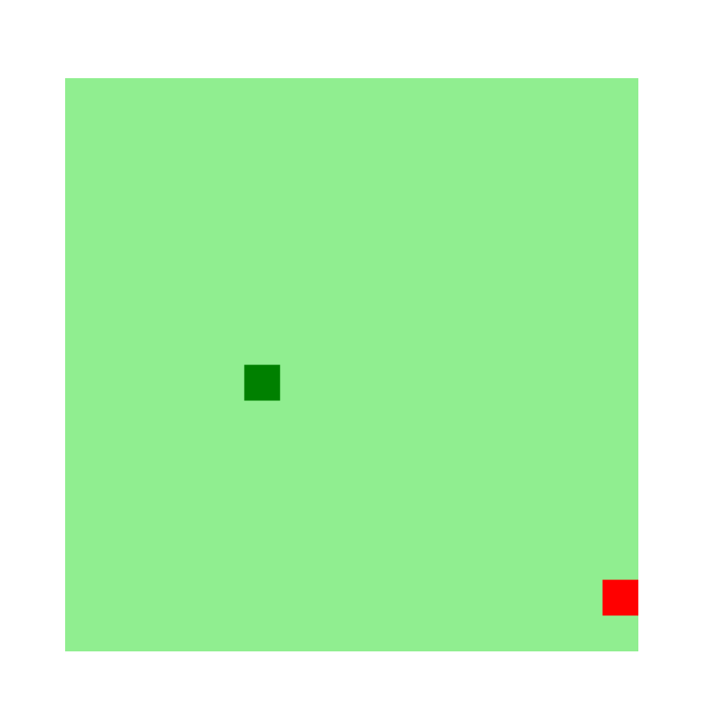
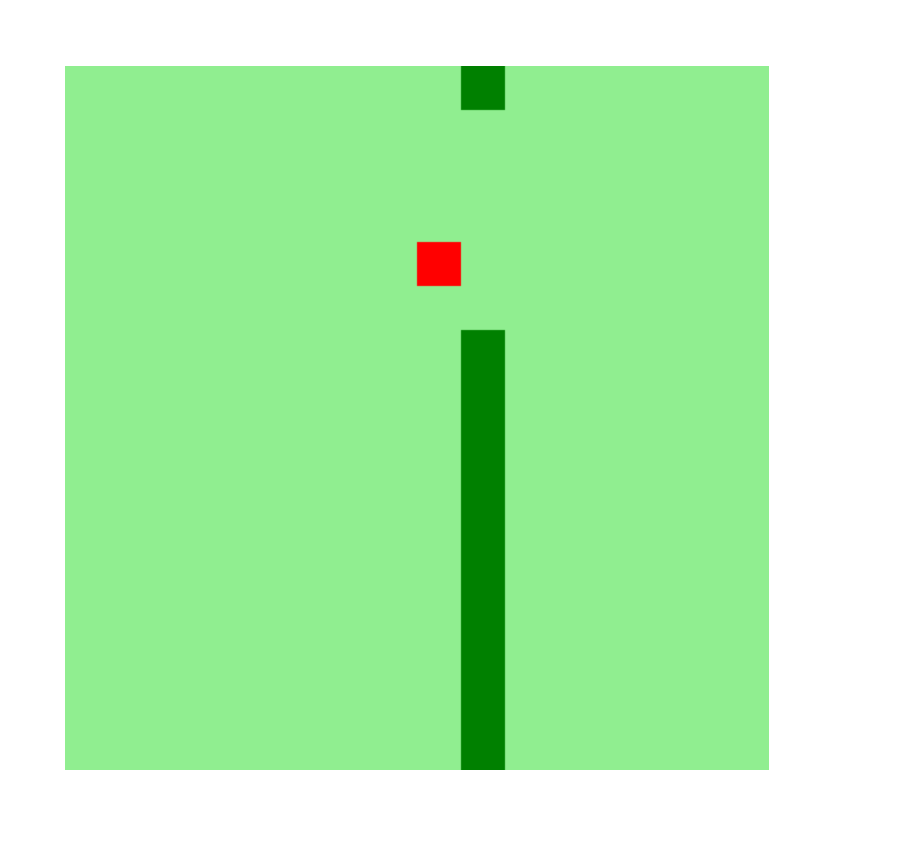

# snake-game

O famoso jogo da cobrinha, desenvolvido junto ao bootcamp HTML Web Developer da Dio - digital inovation one.

## 📦 Tecnologias utilizadas para construção:

- HTML5 -  Como linguagem de marcação.
- CSS3  -  Para estilização. 
- javascript - Para toda a lógica do game.
- canvas - para desenhar o game.

## 🖥 Preview do projeto 

